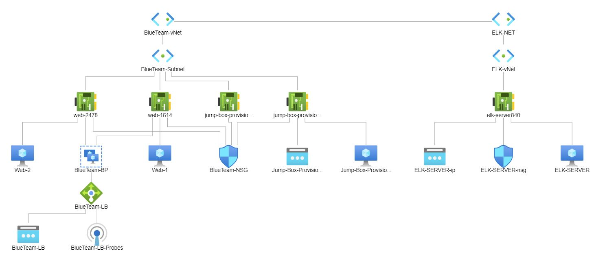

## Automated ELK Stack Deployment

The files in this repository were used to configure the network depicted below.

These files have been tested and used to generate a live ELK deployment on Azure. They can be used to either recreate the entire deployment pictured above. Alternatively, select portions of the YAML file may be used to install only certain pieces of it, such as Filebeat.

  

This document contains the following details:
- Description of the Topology
- Access Policies
- ELK Configuration
  - Beats in Use
  - Machines Being Monitored
- How to Use the Ansible Build

### Description of the Topology

The main purpose of this network is to expose a load-balanced and monitored instance of DVWA, the D*mn Vulnerable Web Application.

Load balancing ensures that the application will be highly available, in addition to restricting ibound access to the network.
- Load balancing is the process of distributing network traffic across multiple servers. This ensures no single server bears too much demand. By spreading the work evenly, load balancing improves application responsiveness. In a security aspect, load balancers can defend an organization against denial-of-service (DDos) attacks.
- Jump box's provide an additional layer of security from the public internet by controlling access to the other machines by allowing connections from specific IP addresses and forwarding to those machines.

Integrating an ELK server allows users to easily monitor the vulnerable VMs for changes to the file systems and system metrics.
- Filebeat collects data about the file system.
- Metricbeat collects machine metrics, such as uptime.

The configuration details of each machine may be found below.

| Name     | Function   | IP Address | Operating System |
|----------|------------|------------|------------------|
| Jump Box | Gateway    | 10.0.0.5   | Linux            |
| Web-1    | Web Server | 10.0.0.6   | Linux            |
| Web-2    | Web Server | 10.0.0.7   | Linux            |
| Elk      | Monitoring | 10.2.0.4   | Linux            |

### Access Policies

The machines on the internal network are not exposed to the public Internet. 

Only the Jump Box machine can accept connections from the Internet. Access to this machine is only allowed from the following IP addresses:
- My IP Address

Machines within the network can only be accessed by the Jumop Box.
- Only the Jump Box has access to the ELK VM 10.2.0.4

A summary of the access policies in place can be found in the table below.

| Name     | Publicly Accessible | Allowed IP Address |
|----------|---------------------|--------------------|
| Jump Box | Yes                 | My IP              |
| Web-1    | No                  | 10.0.0.6          |
| Web-2    | No                  | 10.0.0.7           |
| Elk      | No                  | 10.2.0.5           |

### Elk Configuration

Ansible was used to automate configuration of the ELK machine. No configuration was performed manually, which is advantageous because it allows for consistent, repeatable configuration that reduces the time of deployment and errors.

The playbook implements the following tasks:

- Install Docker
- Install Python3-pip
- Install Docker python module
- Download and launch ELK container
- Enable service Docker on boot
- Use more memory

The following screenshot displays the result of running `docker ps` after successfully configuring the ELK instance.

### Target Machines & Beats
This ELK server is configured to monitor the following machines:

| Name   | Function                        | IP Address  | Operating System |
|--------|---------------------------------|-------------|------------------|
| Web -1 | Host for container running DVWA | 10.0.0.6    | Linux            |
| Web-1  | Host for containing DVWA        | 10.0.0.7    | Linux            |

We have installed the following Beats on these machines:
- Filebeat
- Metricbeat

These Beats allow us to collect the following information from each machine:
- Filebeat collects linux logs. This allows us to track things like user logon events, failed access attempts, service starts and stops.
- Metricbeat collects system metrics from the web servers. We look for things like cpu usage, memory usage, drive space usage and drive space available for each host.

### Using the Playbook
In order to use the playbook, you will need to have an Ansible control node already configured. Assuming you have such a control node provisioned: 

SSH into the control node and follow the steps below:
- Copy the ansible.cfg file to ~/etc/ansible
- Update the hosts file to include the hosts that you would like to manage, eg: [ELK] 10.1.0.4 ansible_python_interpreter=/usr/bin/python3
- Run the playbook, and navigate to http://40.115.93.191:5601/app/kibana to check that the installation worked as expected.

